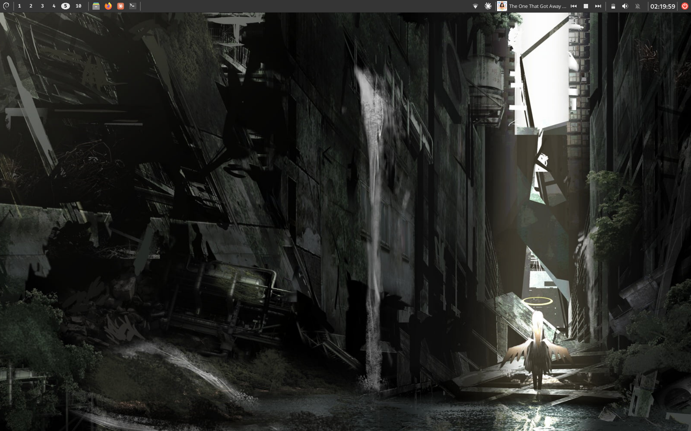
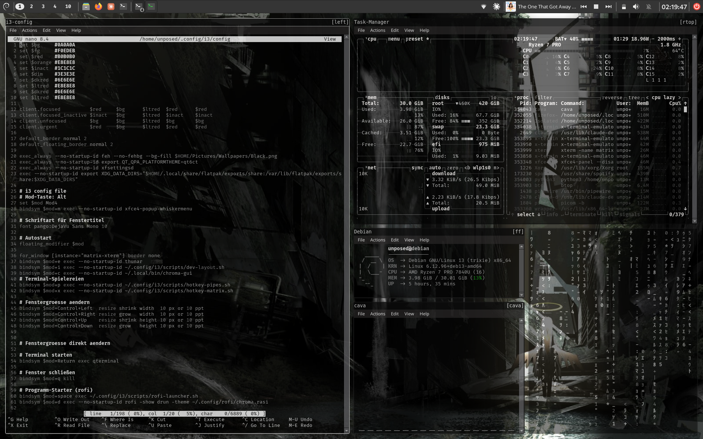
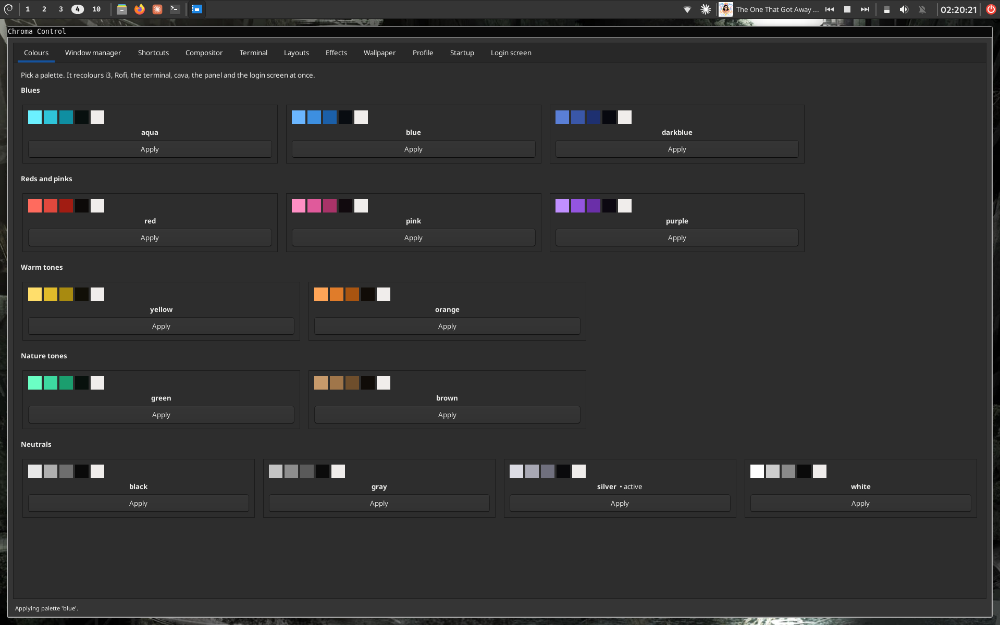

# dotfiles - Chroma

Debian 13 (Trixie) - i3wm - xfce4-panel - picom v12 - qterminal

A dark setup built around **14 switchable colour palettes**. One hotkey
recolours everything at once: i3 borders, Rofi, the terminal, cava, nano,
fastfetch, the panel, GRUB and the login screen.





## Quick start on a fresh system

```bash
sudo apt install -y git
git clone https://github.com/ItsUnposed/Debian-Dotfiles.git ~/dotfiles
~/dotfiles/install.sh
```

The installer sets everything up: i3, LightDM, picom, the panel, themes and
the colour palette. Reboot afterwards, pick the **i3** session in the top
right corner of the login screen and log in.

Tested on a plain Debian 13 netinstall without a desktop environment.

## Colour system

Every palette is a plain key-value file in `config/chroma/palettes/`:

```
aqua   black   blue   brown   darkblue   gray   green
orange   pink   purple   red   silver   white   yellow
```

Each palette defines the same variables:

| Variable    | Meaning                            |
|-------------|------------------------------------|
| `C_ACC`     | Main accent (borders, highlights)  |
| `C_ACC2`    | Secondary accent (keywords)        |
| `C_ACC3`    | Third accent (subtle borders)      |
| `C_BG`      | Background                         |
| `C_BG2`     | Second level background            |
| `C_DIM`     | Dimmed text                        |
| `C_FG`      | Foreground / normal text           |
| `C_TERM`    | Terminal base colour               |
| `WALLPAPER` | Matching background image          |

`config/chroma/apply.sh <name>` writes those values into every target
configuration through templates and reloads the affected programs. The active
palette lives in `current.conf`, which is generated locally and stays out of
the repository.

Switch palettes with <kbd>Super</kbd>+<kbd>-</kbd> or from Chroma Control.

## Chroma Control

A GUI for the whole setup, reachable with <kbd>Super</kbd>+<kbd>c</kbd> or from
Rofi. Sixteen pages, grouped by topic:

| Area          | Pages                                              |
|---------------|----------------------------------------------------|
| Appearance    | Colours, New palette, Wallpaper                    |
| Windows       | Window manager, Shortcuts, Displays, Layouts       |
| Compositing   | Compositor, Animations, Opacity rules              |
| Programs      | Terminal, Effects                                  |
| System        | Profile, Login screen, Startup, Backups            |

A few things worth calling out:

- **Colours** shows every palette as a card with swatches. The tick box next to
  Apply decides whether it appears straight away in the <kbd>Super</kbd>+<kbd>-</kbd>
  menu or behind `More ...`.
- **New palette** builds a palette from colour pickers, copying another one as a
  starting point, and files it under a group of your choosing. Groups live in
  `config/chroma/groups.conf`, so new ones can be created by typing a name.
- **Displays** reads the connected screens from `xrandr` and lets you click
  which workspace belongs to which screen. Without a saved assignment they are
  spread evenly: two screens give 1-5 and 6-0, three give 1-3, 4-6 and 7-0. The
  layout itself can be stored with `autorandr` so it comes back on docking.
- **Backups** lists every timestamped copy the app has written, restores one
  with a click, and can take a fresh snapshot of all managed files on demand.

Nothing is written until an Apply button is pressed, and every file is copied to
`<file>.bak-<timestamp>` beforehand.

Needs `python3-gi`, `gir1.2-gtk-3.0`, `python3-gi-cairo`, `imagemagick` and,
for the display page, `autorandr`.

## Keyboard shortcuts

The modifier is the **Super key**.

### Programs

| Combination                       | Action                         |
|-----------------------------------|--------------------------------|
| <kbd>Super</kbd>+<kbd>Return</kbd>| Terminal (qterminal)           |
| <kbd>Super</kbd>+<kbd>e</kbd>     | File manager (Thunar)          |
| <kbd>Super</kbd>+<kbd>d</kbd>     | Rofi (drun)                    |
| <kbd>Super</kbd>+<kbd>Space</kbd> | Rofi launcher with web search  |
| <kbd>Super</kbd>+<kbd>m</kbd>     | Whisker menu                   |
| <kbd>Super</kbd>+<kbd>n</kbd>     | NetworkManager applet          |
| <kbd>Super</kbd>+<kbd>c</kbd>     | Chroma Control                 |
| <kbd>Print</kbd>                  | Screenshot (Flameshot)         |

### Windows

| Combination                                        | Action                    |
|----------------------------------------------------|---------------------------|
| <kbd>Super</kbd>+<kbd>q</kbd>                      | Close window              |
| <kbd>Super</kbd>+<kbd>f</kbd>                      | Fullscreen                |
| <kbd>Super</kbd>+<kbd>t</kbd>                      | Semi fullscreen           |
| <kbd>Super</kbd>+<kbd>Shift</kbd>+<kbd>Space</kbd> | Toggle floating           |
| <kbd>Super</kbd>+<kbd>Arrow</kbd>                  | Move focus                |
| <kbd>Super</kbd>+<kbd>Shift</kbd>+<kbd>Arrow</kbd> | Move window               |
| <kbd>Super</kbd>+<kbd>Ctrl</kbd>+<kbd>Arrow</kbd>  | Resize window             |
| <kbd>Super</kbd>+<kbd>h</kbd> / <kbd>v</kbd>       | Split horizontal/vertical |
| <kbd>Super</kbd>+<kbd>s</kbd> / <kbd>w</kbd>       | Stacking / tabbed         |
| <kbd>Super</kbd>+<kbd>a</kbd>                      | Focus parent container    |
| <kbd>Super</kbd>+<kbd>Tab</kbd>                    | Switch tiling/floating    |

### Workspaces

| Combination                                                 | Action                    |
|-------------------------------------------------------------|---------------------------|
| <kbd>Super</kbd>+<kbd>1</kbd> to <kbd>0</kbd>               | Switch workspace          |
| <kbd>Super</kbd>+<kbd>Shift</kbd>+<kbd>1</kbd> to <kbd>0</kbd> | Move window there      |

### Toys and system

| Combination                                    | Action                    |
|------------------------------------------------|---------------------------|
| <kbd>Super</kbd>+<kbd>-</kbd>                  | Palette menu              |
| <kbd>Super</kbd>+<kbd>o</kbd>                  | Hacker startup layout     |
| <kbd>Super</kbd>+<kbd>i</kbd>                  | Dev layout (pick an IDE)  |
| <kbd>Super</kbd>+<kbd>p</kbd>                  | pipes                     |
| <kbd>Super</kbd>+<kbd>x</kbd>                  | unimatrix                 |
| <kbd>Super</kbd>+<kbd>y</kbd>                  | cava                      |
| <kbd>Super</kbd>+<kbd>Shift</kbd>+<kbd>x</kbd> | Lock the screen           |
| <kbd>Super</kbd>+<kbd>Shift</kbd>+<kbd>e</kbd> | Power menu                |
| <kbd>Super</kbd>+<kbd>Shift</kbd>+<kbd>c</kbd> | Reload i3                 |
| <kbd>Super</kbd>+<kbd>Shift</kbd>+<kbd>r</kbd> | Restart i3                |
| <kbd>Brightness +/-</kbd>                      | brightnessctl             |

## Hacker startup

<kbd>Super</kbd>+<kbd>o</kbd> builds a five part layout:

```
+----------------+-------------------------------+
|                |          task manager         |
|   i3 config    +---------------+---------------+
|   50% width    |  fastfetch    |               |
|                +---------------+    matrix     |
|                |  cava         |               |
+----------------+---------------+---------------+
```

Every window picks up the active palette colour and runs with picom
transparency.

## Dev layout

<kbd>Super</kbd>+<kbd>i</kbd> opens a Rofi menu with PyCharm, IntelliJ IDEA
and CLion. The chosen IDE starts on the left at 82% width, with matrix above
pipes on the right.

## Structure

| Folder         | Contents                                   |
|----------------|--------------------------------------------|
| `config/`      | symlinked into `~/.config/<name>`          |
| `home/`        | files that go straight into `~`            |
| `system/`      | `/etc/default/grub`, LightDM               |
| `packages/`    | APT and Flatpak lists                      |
| `xfce/`        | xfconf XML of the panel configuration      |
| `themes/`      | GRUB and greeter themes                    |
| `local-bin/`   | own scripts for `~/.local/bin`             |
| `wallpaper/`   | one background image per palette           |
| `screenshots/` | images used in this README                 |
| `scripts/`     | helper scripts that are not part of the desktop |

`config/i3`, `config/cava`, `config/fastfetch` and `config/rofi` are symlinks,
so edits under `~/.config` land in the repository straight away. Everything
else is copied by `save.sh`.

## Saving

```bash
~/dotfiles/save.sh
```

Copies every non symlinked config into the repository, refreshes the package
lists, commits and pushes.

## Things worth knowing

Hard won lessons from building this, so they do not have to be found twice:

- **picom v12 uses `rules = ()`**. Once it is present, older options such as
  `opacity-rule`, `shadow-exclude` or `wintypes` are ignored completely, and
  so is a top level `animations` list.
- **picom applies the first matching rule only.** A general rule placed above
  a specific one silently wins.
- **WM_CLASS matching is case sensitive**: `qterminal`, not `QTerminal`.
- **`exec` versus `exec_always`**: services that should come back after an i3
  restart need `exec_always`; the hacker startup needs plain `exec` or it
  launches twice.
- **`quiet_boot` is hard wired to `0` in Debian's `/etc/grub.d/10_linux`.**
  The "Loading Linux ..." lines only disappear after patching it to `1`, and a
  `grub-common` update resets that.
- **Closing animations get cut short in a tiling layout**, because i3 reflows
  the remaining windows immediately. Floating windows animate reliably.
- **cava must run in the foreground.** Backgrounding it inside a terminal
  wrapper kills it instantly, unlike `pipes`, which needs exactly that.
- **Xfce keyboard shortcuts run alongside i3** and swallow combinations before
  i3 sees them. Inspect them with
  `xfconf-query -c xfce4-keyboard-shortcuts -l`.

## Licence

MIT, see [LICENSE](LICENSE).
